# Chaum-Pedersen Zero-Knowledge Proof Authentication System

A complete client-server implementation of the Chaum-Pedersen Zero-Knowledge Proof protocol in Rust, featuring gRPC communication for secure authentication without revealing passwords.

## 🔒 Overview

This project implements a **Chaum-Pedersen Zero-Knowledge Proof (ZKP)** authentication system that allows users to prove knowledge of a secret (password) without ever transmitting it over the network. The system consists of:

- **ZKP Library**: Core cryptographic implementation
- **gRPC Server**: Authentication service
- **CLI Client**: Interactive authentication client

The protocol proves that two pairs `(α, y1)` and `(β, y2)` have the same secret exponent `x`:
```
y1 = α^x mod p
y2 = β^x mod p
```

## Protocol Flow

```mermaid
sequenceDiagram
    participant C as Client (Prover)
    participant S as Server (Verifier)
    
    Note over C,S: Registration Phase
    C->>S: Register(user, y1, y2)
    Note right of S: Store user commitments
    S->>C: RegisterResponse (empty)
    
    Note over C,S: Authentication Phase
    C->>S: CreateAuthenticationChallenge<br/>(user, r1=α^k mod p, r2=β^k mod p)
    Note right of S: Generate challenge c
    S->>C: AuthenticationChallengeResponse<br/>(auth_id, c)
    
    C->>S: VerifyAuthentication<br/>(auth_id, s=k-c⋅x mod q)
    Note right of S: Verify proof
    S->>C: AuthenticationAnswerResponse<br/>(session_id)
```



## 📁 Project Structure

```
zkp_chaum_pedersen/
├── proto/                          # Protocol Buffers definitions
│   └── zkp_auth.proto             # gRPC service definition
├── src/
│   ├── lib.rs                     # Core ZKP implementation
│   ├── server.rs                  # gRPC authentication server
│   ├── client.rs                  # CLI authentication client
│   └── zkp_auth.rs               # Generated gRPC code
├── Cargo.toml                     # Dependencies and project config
└── README.md                      # This file
```

## 🔧 Features

### Core ZKP Library (`lib.rs`)
- **Efficient Modular Arithmetic**: Using `num-bigint` for large integer operations
- **Cryptographically Secure**: 1024-bit and 2048-bit parameter support
- **Secure Random Generation**: Cryptographically secure randomness
- **Comprehensive Testing**: Multiple test scenarios with different key sizes

### gRPC Server (`server.rs`)
- **Concurrent User Management**: Thread-safe user storage with `Mutex<HashMap>`
- **Session Management**: Auth ID to user mapping for challenge tracking
- **Error Handling**: Proper gRPC status codes and error messages
- **Real-time Logging**: Detailed request/response logging

### CLI Client (`client.rs`)
- **Interactive Authentication**: Step-by-step user prompts
- **Password-to-BigInt Conversion**: Secure password handling
- **Full Protocol Implementation**: Registration → Challenge → Verification
- **Connection Management**: Robust gRPC client connection

## 📦 Dependencies

```toml
[dependencies]
num-bigint = { version = "0.4", features = ["rand"] }
rand = "0.8"
hex = "0.4"
tokio = { version = "1.0", features = ["full"] }
tonic = "0.12"
prost = "0.13"

[build-dependencies]
tonic-build = "0.12"
```

## Variable Reference

| Parameter | Description | Usage in Code |
|-----------|-------------|---------------|
| `p` | Large prime modulus (1024/2048-bit) | Field for all arithmetic operations |
| `q` | Subgroup order, `q \| (p-1)` | Modulus for secret operations |
| `α` (alpha) | First generator | Base for first commitment `y1 = α^x mod p` |
| `β` (beta) | Second generator | Base for second commitment `y2 = β^x mod p` |
| `x` | Secret key (password) | User's private authentication secret |
| `k` | Random nonce | One-time random value for each proof |
| `c` | Challenge value | Server-generated random challenge |
| `y1, y2` | Public commitments | Stored during registration |
| `r1, r2` | Proof commitments | `α^k mod p`, `β^k mod p` |
| `s` | Response value | `k - c*x mod q` |

## 🚀 Getting Started

### Prerequisites

```bash
# Install Rust
curl --proto '=https' --tlsv1.2 -sSf https://sh.rustup.rs | sh

# Install Protocol Buffers compiler
# macOS
brew install protobuf

```

### Building the Project

```bash
# Clone the repository
git clone <your-repo-url>
cd zkp_chaum_pedersen

# Build the project
cargo build --release

# Run tests
cargo test
```

### Running the System

#### 1. Start the Server

```bash
cargo run --bin server
```

Output:
```
✅ Running the server in 127.0.0.1:50051
```

#### 2. Run the Client

```bash
cargo run --bin client
```

Interactive session:
```
✅ Connected to the server
Please provide the username:
> alice
Please provide the password:
> mysecretpassword
Response from server during registration: ...
Registration successful for user: alice
Please provide the password (to login):
> mysecretpassword
Challenge received: auth_id = xyz123abc456, challenge = 12345...
✅Logging successful! session_id: def789ghi012
```

## 🔍 API Reference

### Core ZKP Struct

```rust
pub struct ZKP {
    p: BigUint,     // Prime modulus
    q: BigUint,     // Subgroup order  
    alpha: BigUint, // First generator α
    beta: BigUint,  // Second generator β
}
```

### Key Methods

#### `compute_pair(&self, exp: &BigUint) -> (BigUint, BigUint)`
Computes `(α^exp mod p, β^exp mod p)` for registration and proof generation.

```rust
// Registration: compute public commitments
let (y1, y2) = zkp.compute_pair(&password);

// Authentication: compute proof commitments  
let (r1, r2) = zkp.compute_pair(&random_k);
```

#### `solve(&self, k: &BigUint, c: &BigUint, x: &BigUint) -> BigUint`
Computes the ZKP response: `s = k - c*x mod q`

```rust
let s = zkp.solve(&random_k, &challenge, &password);
```

#### `verify(&self, r1: &BigUint, r2: &BigUint, y1: &BigUint, y2: &BigUint, c: &BigUint, s: &BigUint) -> bool`
Verifies the zero-knowledge proof by checking:
- `r1 ≟ α^s * y1^c mod p`
- `r2 ≟ β^s * y2^c mod p`

```rust
let is_valid = zkp.verify(&r1, &r2, &y1, &y2, &challenge, &response);
```

#### Utility Functions

```rust
// Generate cryptographically secure random numbers
let random_value = ZKP::generate_random_number_below(&bound);

// Generate random alphanumeric strings (for session IDs)
let session_id = ZKP::generate_random_string(12);

// Get predefined cryptographic constants
let (alpha, beta, p, q) = ZKP::get_constants();
```

## 📡 gRPC Interface

### Service Definition (`zkp_auth.proto`)

```protobuf
service Auth {
    rpc Register(RegisterRequest) returns (RegisterResponse);
    rpc CreateAuthenticationChallenge(AuthenticationChallengeRequest) 
        returns (AuthenticationChallengeResponse);
    rpc VerifyAuthentication(AuthenticationAnswerRequest) 
        returns (AuthenticationAnswerResponse);
}
```

### Message Types

| Message | Fields | Purpose |
|---------|--------|---------|
| `RegisterRequest` | `user: string`, `y1: bytes`, `y2: bytes` | User registration with commitments |
| `AuthenticationChallengeRequest` | `user: string`, `r1: bytes`, `r2: bytes` | Request authentication challenge |
| `AuthenticationChallengeResponse` | `auth_id: string`, `c: bytes` | Server challenge response |
| `AuthenticationAnswerRequest` | `auth_id: string`, `s: bytes` | Submit proof response |
| `AuthenticationAnswerResponse` | `session_id: string` | Successful authentication |

### Server State Management

```rust
pub struct AuthImpl {
    // User information storage
    pub user_info: Mutex<HashMap<String, UserInfo>>,
    // Active authentication sessions
    pub auth_id_to_user: Mutex<HashMap<String, String>>,
}

pub struct UserInfo {
    pub user_name: String,
    pub y1: BigUint,        // Registration commitments
    pub y2: BigUint,
    pub r1: BigUint,        // Challenge commitments  
    pub r2: BigUint,
    pub c: BigUint,         // Challenge value
    pub s: BigUint,         // Response value
    pub session_id: String, // Active session
}
```

## 🧪 Testing

The project includes comprehensive tests:

### Test Scenarios

```bash
# Run all tests
cargo test

# Run specific test
cargo test test_toy_example
cargo test test_1024_bits_constants
cargo test test_2048_bits_constants
```

#### `test_toy_example`
- Uses small fixed values for educational purposes
- `α=4, β=9, p=23, q=11, x=6, k=7, c=4`
- Expected: `y1=2, y2=3, r1=8, r2=4, s=5`

#### `test_1024_bits_constants`
- Uses DSA-standard 1024-bit parameters
- Tests with random values for production readiness

#### `test_2048_bits_constants`
- Uses 2048-bit parameters for enhanced security
- Suitable for high-security environments

### Sample Test Output

```
α: 4, β: 9, p: 23, x: 6, k: 7, c: 4
y1: 2, y2: 3, c: 4
r1: 8, r2: 4, s: 5
Verification result: true
```

## 🔐 Security Features

### Cryptographic Security
- **1024/2048-bit Parameters**: Industry-standard key sizes
- **DSA-Compatible**: Uses well-vetted cryptographic parameters
- **Secure Randomness**: `rand::thread_rng()` for all random generation
- **Modular Arithmetic**: Efficient and secure `BigUint` operations

### Protocol Security
- **Zero-Knowledge**: Server never sees the password
- **Challenge-Response**: Prevents replay attacks
- **Session Management**: Temporary auth IDs for challenge tracking
- **Input Validation**: Proper error handling for invalid requests

### Implementation Security
- **Thread Safety**: `Mutex` protection for concurrent access
- **Memory Safety**: Rust's ownership system prevents common vulnerabilities
- **Error Handling**: Comprehensive error propagation and logging

## 🚨 Security Considerations

### Production Deployment
1. **TLS Encryption**: Always use TLS for gRPC communication
2. **Rate Limiting**: Implement request rate limiting
3. **Audit Logging**: Log all authentication attempts
4. **Parameter Validation**: Validate all cryptographic parameters
5. **Session Expiry**: Implement session timeout mechanisms

### Cryptographic Best Practices
- **Never Reuse Nonces**: Each authentication must use a fresh `k`
- **Secure Parameter Generation**: Use well-tested cryptographic parameters
- **Side-Channel Protection**: Consider timing attack mitigation
- **Key Storage**: Secure client-side password/key storage

## 🔧 Configuration

### Cryptographic Parameters

The system supports multiple parameter sets:

```rust
// 1024-bit parameters (standard security)
let (alpha, beta, p, q) = ZKP::get_constants();

// 2048-bit parameters (high security) - available in tests
// Custom parameters can be loaded from configuration
```

### Server Configuration

```rust
// Default server address
let addr = "127.0.0.1:50051";

// Customize for production
let addr = std::env::var("SERVER_ADDR")
    .unwrap_or_else(|_| "0.0.0.0:50051".to_string());
```

## 🐛 Troubleshooting

### Common Issues

#### Connection Refused
```
Error: transport error
```
**Solution**: Ensure the server is running before starting the client.

#### Build Errors
```
error: failed to run custom build command for `zkp_chaum_pedersen`
```
**Solution**: Install Protocol Buffers compiler (`protobuf-compiler`).

#### Authentication Failures
```
Status { code: PermissionDenied, message: "bad solution to the challenge" }
```
**Solution**: Ensure the same password is used for registration and authentication.

### Debug Mode

Enable detailed logging:
```bash
RUST_LOG=debug cargo run --bin server
```

## 📈 Performance

### Benchmarks (approximate)

| Operation | 1024-bit | 2048-bit | Notes |
|-----------|----------|----------|-------|
| Key Generation | ~1ms | ~5ms | One-time cost |
| Proof Generation | ~2ms | ~10ms | Per authentication |
| Proof Verification | ~3ms | ~15ms | Server-side cost |

### Optimization Opportunities
- **Parameter Caching**: Cache cryptographic parameters
- **Connection Pooling**: Reuse gRPC connections
- **Async Processing**: Parallel proof verification
- **Hardware Acceleration**: Consider cryptographic accelerators


### Development Guidelines
- Follow Rust conventions and `rustfmt`
- Add tests for new functionality
- Update documentation for API changes
- Ensure all tests pass before submitting

## 📚 References

### Academic Papers
- Chaum, D. and Pedersen, T.P. (1992). "Wallet Database with Observers"
- Schnorr, C.P. (1991). "Efficient Signature Generation by Smart Cards"
- Fiat, A. and Shamir, A. (1987). "How to Prove Yourself"

### Standards
- [RFC 5114](https://tools.ietf.org/html/rfc5114) - Additional DH Groups for Use with IETF Standards
- [FIPS 186-4](https://nvlpubs.nist.gov/nistpubs/FIPS/NIST.FIPS.186-4.pdf) - Digital Signature Standard


## 🙏 Acknowledgments

- **num-bigint** crate for efficient big integer arithmetic
- **tonic** for excellent gRPC support in Rust
- **tokio** for async runtime
- The cryptographic community for well-vetted parameters and protocols